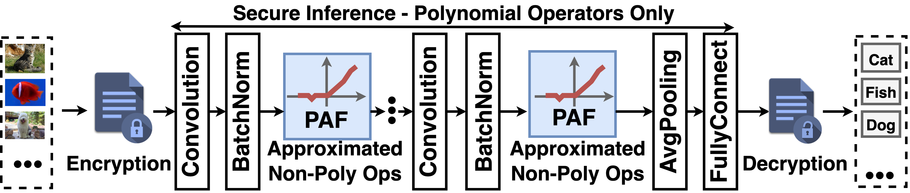
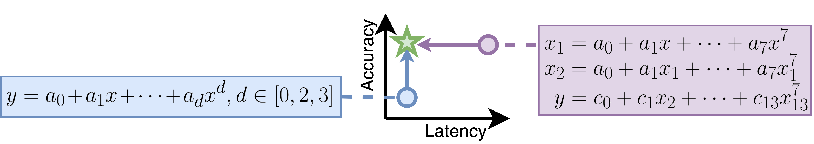

# PAF-FHE: Low-Cost Accurate Non-Polynomial Operator Polynomial Approximation in Fully Homomorphic Encryption Based ML Inference [[Paper]](https://assets.researchsquare.com/files/rs-2910088/v1_covered_0e6c94bd-1499-4b2c-b414-902c232b490c.pdf?c=1683777877) [[Poster]](https://jianmingtong.github.io/publications/PAF_FHE_poster.pdf)
```
@misc {PPR:PPR658940, 
    Title = {PAF-FHE: Low-Cost Accurate Non-Polynomial Operator Polynomial Approximation in Fully Homomorphic Encryption Based ML Inference}, Author = {Dang, Jingtian and Tong, Jianming and Golder, Anupam and Raychowdhury, Arijit and Hao, Cong and Krishna, Tushar}, 
    DOI = {10.21203/rs.3.rs-2910088/v1}, 
    Publisher = {Research Square}, 
    Year = {2023}, 
    URL = {https://doi.org/10.21203/rs.3.rs-2910088/v1}, }
```
## Motivation
Secure Fully Homomorphic Encryption (FHE) based Machine Learning Inference Converts Non-polynomial Operators (ReLU/MaxPooling) into Polynomial Approximation Functions (PAF)


Existing PAFs suffer from either prohibitive latency overhead or low accuracy. PAF-FHE proposes four training techniques to enable exploration on the entire PAF degree space and spot high-accuracy low-latency PAF.


## Results
PAF-FHE spots optimal 14-degree PAF with 69.4% accuracy (the same accuracy as plaintext pretrained ResNet-18 under ImageNet-1k dataset) and saves 72% latency of 27-degree Minimax PAF.

|  |  | $f_1^2 \circ g_1^2$ | alpha=7 | $f_2\circ g_3$ | $f_2\circ g_2$ | $f_1\circ g_2$ |
| --- | --- | --- | --- | --- | --- | --- |
| Replace ReLU Only | direct replacement | 64.70% | 54.70% | 51.30% | 32.00% | 29.90% |
|  | baseline | 64.30% | 66.40% | 64.20% | 58.30% | 53.10% |
|  | baseline + CT | 68.60% | 67.70% | 67.00% | 66.50% | 61.70% |
|  | baseline + AT | 65.20% | 68.30% | 63.70% | 60.50% | 52.00% |
|  | baseline + PR | 65.60% | 68.40% | 64.60% | 60.20% | 52.60% |
|  | PR | 63.40% | 68.10% | 63.30% | 57.60% | 49.50% |
|  | baseline + PR + CT | 68.20% | 67.00% | 67.60% | 65.90% | 60.80% |
|  | baseline +PR + AT | 64.90% | 67.40% | 64.60% | 56.50% | 47.10% |
|  | baseline + CT + PR + AT | 69.00% | 68.10% | 61.40% | 66.50% | 63.10% |
|  | Accuracy Improvement over direct replacement | 1.07 | 1.24 | 1.20 | 2.08 | 2.11 |
|  | Accuracy Improvement over baseline | 1.07 | 1.03 | 0.96 | 1.14 | 1.19 |
| Replace All Non-linear | baseline + CT + PR + AT | 69.40% | 67.00% | 65.30% | 57.30% | 6.50% |
|  | Accuracy Improvement over baseline | 1.07 | 1.22 | 1.27 | 1.79 | 0.22 |
|  | Accuracy Improvement over baseline | 1.08 | 1.01 | 1.02 | 0.98 | 0.12 |


# Ready to run?
```
#Activate Conda
# Create a python3.8 enviroment
conda create --name PAF-FHE  python=3.8

# Activate the enviroment
conda activate PAF-FHE

# Install package
conda install pytorch torchvision torchaudio pytorch-cuda=11.7 -c pytorch -c nvidia
conda install -c conda-forge pytorch-lightning

# Download cifar10 pretrained models
cd PyTorch_CIFAR10/
sh download_weights.sh 
cd ..

# Open /global_config/global_config.yaml
#Edit "dataset_dirctory:" to set a folder to store dataset.

# Download dataset
python3 util.py -dd True --dataset cifar10
python3 util.py -dd True --dataset cifar100
python3 util.py -dd True --dataset imagenet_1k
```


## Control Parameters for the library
```
typical step
For one model with a dataset, one -wd (working directory) should be used
--model: 		resnet18, vgg19_bn, resnet32
--dataset: 	cifar10, imagenet, cifar100
-st: 			a7, 2f12g1, f2f2, f2g3, f1g2
Supported combination: vgg19_bn & imagenet, vgg19_bn & cifar10, resnet18 & imagenet, and resnet32 & cifar100
-st is the supported PAF type
-dc stands for "data collection": 
```

## ResNet-18 on ImageNet_1k
```
# The following steps must be run in serial, as following steps need results from previous steps.
# Collection CT data
python3 ./CT.py --model resnet18 --dataset imagenet_1k -wd ../resnet18_imagenet1k/ -dc True
# CT
python3 ./CT.py --model resnet18 --dataset imagenet_1k -wd ../resnet18_imagenet1k/ -st 2f12g1
# PA and AT
python3 ./PA_AT.py --model resnet18 --dataset imagenet_1k -wd ../resnet18_imagenet1k/ -st 2f12g1
# Statistic Scale.
python3 ./SS.py --model resnet18 --dataset imagenet_1k -wd ../resnet18_imagenet1k/ -st 2f12g1
```
## ResNet-32 on CiFar-100
```
# The following steps must be run in serial, as following steps need results from previous steps.
# Collection CT data
python3 ./CT.py --model resnet32 --dataset cifar100 -wd ../resnet32_cifar100/ -dc True
# CT
python3 ./CT.py --model resnet32 --dataset cifar100 -wd ../resnet32_cifar100/ -st 2f12g1
# PA and AT
python3 ./PA_AT.py --model resnet32 --dataset cifar100 -wd ../resnet32_cifar100/ -st 2f12g1
# Statistic Scale.
python3 ./SS.py --model resnet32 --dataset cifar100 -wd ../resnet32_cifar100/ -st 2f12g1
```

## VGG-19 on CiFar-10
```
# The following steps must be run in serial, as following steps need results from previous steps.
# Collection CT data
python3 ./CT.py --model vgg19_bn --dataset cifar10 -wd ../vgg19_bn_cifar10/ -dc True
# CT
python3 ./CT.py --model vgg19_bn --dataset cifar10 -wd ../vgg19_bn_cifar10/ -st 2f12g1
# PA and AT
python3 ./PA_AT.py --model vgg19_bn --dataset cifar10 -wd ../vgg19_bn_cifar10/ -st 2f12g1
# Statistic Scale.
python3 ./SS.py --model vgg19_bn --dataset cifar10 -wd ../vgg19_bn_cifar10/ -st 2f12g1
```

## VGG-19 on ImageNet_1k
```
# The following steps must be run in serial, as following steps need results from previous steps.
# Collection CT data
python3 ./CT.py --model vgg19_bn --dataset imagenet_1k -wd ../vgg19_bn_imagenet1k/ -dc True
# CT
python3 ./CT.py --model vgg19_bn --dataset imagenet_1k -wd ../vgg19_bn_imagenet1k/ -st 2f12g1
# PA and AT
python3 ./PA_AT.py --model vgg19_bn --dataset imagenet_1k -wd ../vgg19_bn_imagenet1k/ -st 2f12g1
# Statistic Scale.
python3 ./SS.py --model vgg19_bn --dataset imagenet_1k -wd ../vgg19_imagenet1k/ -st 2f12g1
```

# Maintainers

- Jingtian Dang (dangjingtian@cmu.edu)
- Jianming Tong (jianming.tong@gatech.edu)
